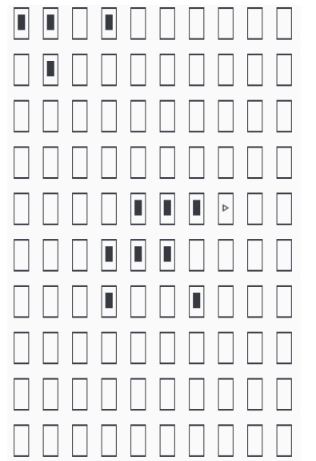
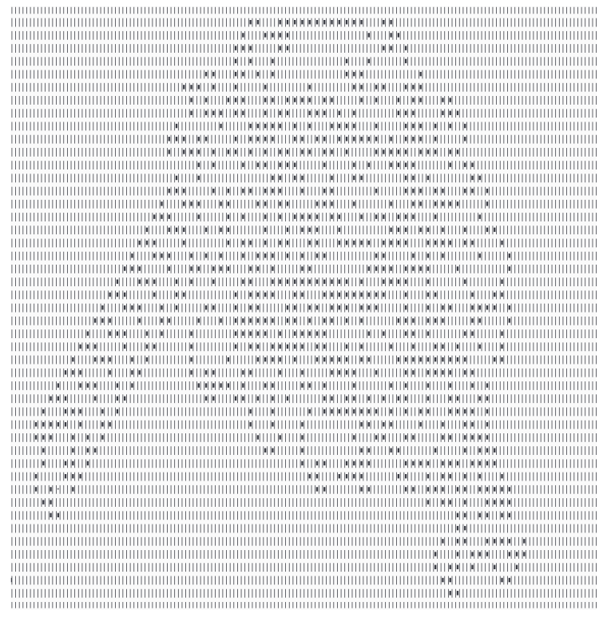

# JIMP_Projekt Program Symulacji Mrówki Langtona 🐜

[English version](#jimp_project-langtons-ant-simulation-program)
## Opis

Program symuluje zachowanie [Mrówki Langtona](https://pl.wikipedia.org/wiki/Mr%C3%B3wka_Langtona), automatu komórkowego zaproponowanego przez Chrisa Langtona w 1986 roku. W każdym kroku mrówka obraca się w lewo lub w prawo, zmienia kolor komórki, na której stoi, a następnie przemieszcza się do następnej komórki.

### 📋 Funkcje

- 🛠️ Tworzenie planszy o określonych wymiarach.
- 🔄 Wykonywanie określonej liczby kroków symulacji.
- 💾 Zapisywanie stanu planszy po każdej iteracji do plików.
- 📂 Możliwość wczytywania stanu początkowego planszy z pliku.
- 🧭 Ustawienie początkowego kierunku mrówki.

## 🛠️ Wymagania

- 🖥️ Kompilator języka C.
- 🐧 System operacyjny UNIX (Linux, macOS).

## 🧩 Kompilacja

Program można skompilować za pomocą narzędzia `make` na pliku "Makefile". Przykładowa komenda kompilacji:

```bash
make -f Makefile
```

## 🚀 Użycie

```bash
./app [opcje]
```

Gdzie opcje mogą zawierać:

- `-w <szerokość>`: Szerokość planszy (domyślnie 10).
- `-h <wysokość>`: Wysokość planszy (domyślnie 10).
- `-i <iteracje>`: Liczba iteracji symulacji (domyślnie 10).
- `-d <kierunek>`: Początkowy kierunek mrówki (NORTH, EAST, SOUTH, WEST) (domyślnie NORTH).
- `-o <zagęszczenie>`: Zagęszczenie przeszkód na planszy (procentowo od 0 do 100) (domyślnie 0).
- `-n <nazwa_pliku>`: Bazowa nazwa pliku do zapisu stanu planszy. (domyślnie pliki są zapisywane w folderze "output").
- `-l <nazwa_pliku>`: Nazwa pliku do wczytania początkowego stanu planszy. (domyślnie plik jest czytany z folderu "source").
- `-p` : Wypisuje pomoc dla programu.

## 📊 Przykładowe Uruchomienie

```bash
./app -w 20 -h 20 -i 100 -d NORTH -o 30 -n symulacja
```

## 📸 Przykłady Wizualizacji

Poniżej znajdują się przykładowe wizualizacje działania symulacji Mrówki Langtona:

### Obraz 1


### Obraz 2


## 📜 Licencja

Ten projekt jest licencjonowany na podstawie [MIT License](https://opensource.org/licenses/MIT).

## 📖 Srpawozdanie

Pełne sprawozdanie projektu jest dostępna w pliku PDF. Kliknij [tutaj](Sprawozdanie.pdf), aby pobrać dokumentację.

## 👨‍💻👨‍💻 Autorzy
Stanisław Dutkiewicz Filip Kobus


# JIMP_Project Langton's Ant Simulation Program 🐜

## Description

The program simulates the behavior of [Langton's Ant](https://en.wikipedia.org/wiki/Langton%27s_ant), a cellular automaton proposed by Chris Langton in 1986. At each step, the ant turns left or right, changes the color of the cell it is on, and then moves to the next cell.

### 📋 Features

- 🛠️ Creation of a board with specified dimensions.
- 🔄 Performing a specified number of simulation steps.
- 💾 Saving the state of the board after each iteration to files.
- 📂 Ability to load the initial state of the board from a file.
- 🧭 Setting the initial direction of the ant.

## 🛠️ Requirements

- 🖥️ C language compiler.
- 🐧 UNIX operating system (Linux, macOS).

## 🧩 Compilation

The program can be compiled using the `make` tool on the "Makefile". Example compilation command:

```bash
make -f Makefile
```

## 🚀 Usage

```bash
./app [options]
```

Where options may include:

- `-w <width>`: Board width (default 10).
- `-h <height>`: Board height (default 10).
- `-i <iterations>`: Number of simulation iterations (default 10).
- `-d <direction>`: Initial direction of the ant (NORTH, EAST, SOUTH, WEST) (default NORTH).
- `-o <density>`: Density of obstacles on the board (percentage from 0 to 100) (default 0).
- `-n <file_name>`: Base file name for saving the board state. (default files are saved in the "output" folder).
- `-l <file_name>`: File name for loading the initial board state. (default file is loaded from the "source" folder).
- `-p` : Prints help for the program.

## 📊 Example Execution

```bash
./app -w 20 -h 20 -i 100 -d NORTH -o 30 -n symulacja
```

## 📸 Visualization Examples

Below are example visualizations of the Langton's Ant simulation in action:

### Image 1


### Image 2


## 📜 License

This project is licensed under the [MIT License](https://opensource.org/licenses/MIT).


## 📖 Report

Full project report is available in the PDF file. Click [here](Report_En.pdf) to download.


## 👨‍💻👨‍💻 Authors
Stanisław Dutkiewicz Filip Kobus
